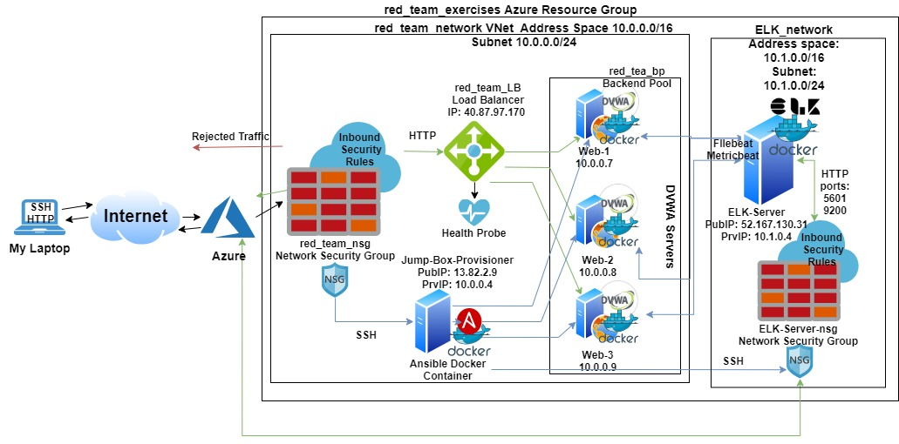
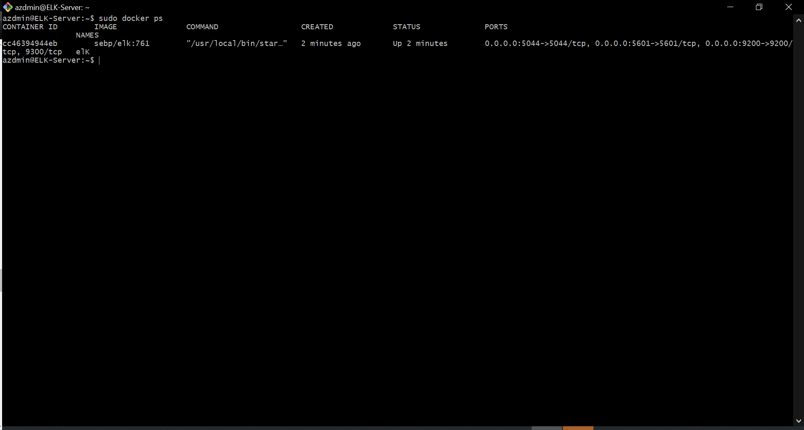

## Automated ELK Stack Deployment

The files in this repository were used to configure the network depicted below.

These files have been tested and used to generate a live ELK deployment on Azure. They can be used to either recreate the entire deployment pictured above. Alternatively, select portions of the YAML playbook file may be used to install only certain pieces of it, such as Filebeat.

This document contains the following details:
- Description of the Topology
- Access Policies
- ELK Configuration
  - Beats in Use
  - Machines Being Monitored
- How to Use the Ansible Build

### Description of the Topology

The main purpose of this network is to expose a load-balanced and monitored instance of DVWA, the D*mn Vulnerable Web Application.

Load balancing ensures that the application will be highly available, in addition to restricting traffic to the network. Load balancing helps to maintain 
the availability of our web application, the third aspect of the CIA triad. On the other hand we use the jump box provisioner to simplify the task of administering
our three web servers by utilizing a single .yml file to configure all three at the same time. This not only ensures that they are all identical, but also makes sure we only have to run the playbook once.

Integrating an ELK server allows users to easily monitor the vulnerable VMs for changes to the logs and system traffic.
What does Filebeat watch for?
Filebeat looks at specific logs and locations we specify and forwards them to logstash and elasticsearch for further analysis, filebeat data can also be aggregated and 
vizualized in kibana.

What does Metricbeat record?
Metricbeat functions similarly to filebeat. The difference is rather than being focused on logs metricbeat focuses on system and application/service metrics and statistics. Like 
filebeat it forwards these to logstash and elasticsearch and can be vizualized in Kibana.

The configuration details of each machine may be found below.

| Name       | Function       | IP Address | Operating System |
|------------|----------------|------------|------------------|
| Jump Box   | Gateway        | 10.0.0.4   | Linux            |
| Web-1      | Webserver      | 10.0.0.7   | Linux            |
| Web-2      | Webserver      | 10.0.0.8   | Linux            |
| Web-3      | Webserver      | 10.0.0.9   | Linux            |
| ELK-Server | ELK monitoring | 10.1.0.4   | Linux            |

### Access Policies

The machines on the internal network are not exposed to the public Internet. 

Only the Jump Box Provisioner machine can accept connections from the Internet. Access to this machine is only allowed from the following IP addresses:
- My Personal Home IP

Machines within the network can only be accessed by SSH.
The ELK VM was accessible via the Jump Box IP 10.0.0.4 via SSH, but also via HTTP from my personal IP over port 5601

A summary of the access policies in place can be found in the table below.

| Name       | Publicly Accessible? | Allowed IP Address            |
|------------|----------------------|-------------------------------|
| Jump Box   | yes                  | Personal IP                   |
| Web-1      | via Load Balancer    | LB: 40.87.97.170 JB: 10.0.0.4 |
| Web-2      | via Load Balancer    | LB: 40.87.97.170 JB: 10.0.0.4 |
| Web-3      | via Load Balancer    | LB: 40.87.97.170 JB: 10.0.0.4 |
| ELK-Server | yes                  | Personal IP JB: 10.0.0.4      |

### Elk Configuration

Ansible was used to automate configuration of the ELK machine. No configuration was performed manually, which is advantageous because it means that we don't have to try and 
replicate our setup on another server, we can simply run our singular yaml config playbook to configure any X number of remote machines in an identical fashion.

The playbook implements the following tasks:
 * Sets the remote machines maximum virtual memory for storing elk elasticsearch indicies in sysctl.
 * Installs docker on the machine
 * Installs pip for Python 3 to alloww the installation of Python packages
 * Uses pip to install the docker python package
 * Installs the elk docker container image and establishes the port: 5601 
The following screenshot displays the result of running `docker ps` after successfully configuring the ELK instance.

### Target Machines & Beats
This ELK server is configured to monitor the following machines:
- _TODO: List the IP addresses of the machines you are monitoring_

We have installed the following Beats on these machines:
- _TODO: Specify which Beats you successfully installed_

These Beats allow us to collect the following information from each machine:
- _TODO: In 1-2 sentences, explain what kind of data each beat collects, and provide 1 example of what you expect to see. E.g., `Winlogbeat` collects Windows logs, which we use to track user logon events, etc._

### Using the Playbook
In order to use the playbook, you will need to have an Ansible control node already configured. Assuming you have such a control node provisioned: 

SSH into the control node and follow the steps below:
- Copy the _____ file to _____.
- Update the _____ file to include...
- Run the playbook, and navigate to ____ to check that the installation worked as expected.

_TODO: Answer the following questions to fill in the blanks:_
- _Which file is the playbook? Where do you copy it?_
- _Which file do you update to make Ansible run the playbook on a specific machine? How do I specify which machine to install the ELK server on versus which to install Filebeat on?_
- _Which URL do you navigate to in order to check that the ELK server is running?

_As a **Bonus**, provide the specific commands the user will need to run to download the playbook, update the files, etc._
